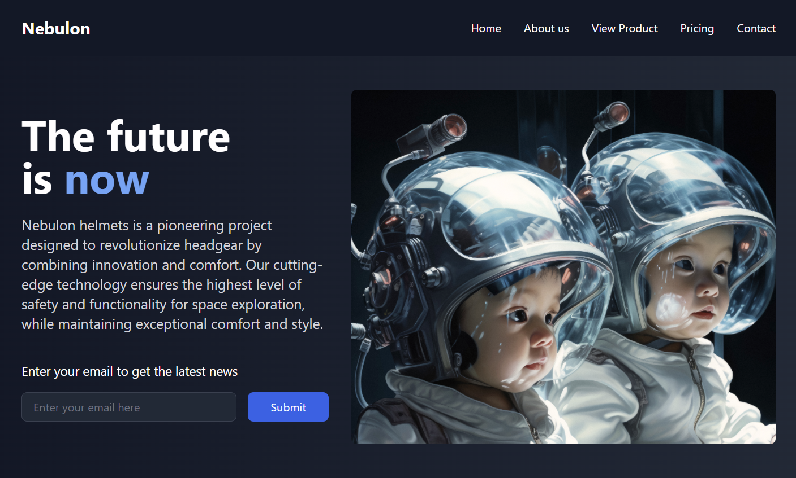

# Nebulon Helmets Website



## Overview
Nebulon Helmets is a modern, responsive website designed to showcase innovative space helmet technology. The project uses HTML, Tailwind CSS, and vanilla JavaScript to provide a fast, accessible, and visually appealing user experience.

## Features
- Responsive design for all devices
- Modern UI with Tailwind CSS
- Product showcase with images and descriptions
- Contact, pricing, and about pages
- Mobile navigation menu
- Optimized for performance and accessibility
- Minimized CLS (Cumulative Layout Shift) for a stable experience

## Project Structure
```
├── index.html
├── about.html
├── products.html
├── pricing.html
├── contact.html
├── css/
│   └── styles.min.css
├── img/
│   ├── helmets-website.png
│   ├── cascobabyrobot.jpg
│   ├── 124CASC.jpg
│   └── ...
├── js/
│   └── main.js
└── ...
```

## Installation
1. Clone the repository:
   ```bash
   git clone https://github.com/Patriciaddc80/HELMETS-NEBULON.git
   ```
2. Open the project folder:
   ```bash
   cd HELMETS-NEBULON
   ```
3. Open `index.html` in your browser to view the site locally.

## Deployment
### Deploy to Netlify
1. Push your latest changes to GitHub.
2. Go to [Netlify](https://app.netlify.com/) and log in.
3. Click **Add new site** > **Import an existing project**.
4. Connect your GitHub account and select this repository.
5. For static sites, set the **Publish directory** to `./`.
6. Click **Deploy site**.

Netlify will provide a public URL for your deployed site. Every push to the `main` branch will automatically update your site.

## License
This project is licensed under the MIT License.

---

Feel free to contribute or open issues to improve the project!
